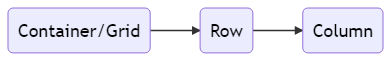

# Session 5 - Layout, Themes, and Widgets

During this session we're going to make the blog more interactive, and look at how you can start adding complex layouts.

## 1. Widgets

### Exercises
Lets start with adding some interactive widgets to your blog. Choose one widget that makes sense for your blog. We've chosen two widgets that make sense for most blogs and are easy to implement below.

Bootstrap has a large library of additional widgets available. See [Bootstrap components documentation page](https://getbootstrap.com/docs/4.3/components).

Open layout-with-bootstrap.html.

+ **Add an image slideshow (carousel)**

	An image carousel is a way of displaying a slideshow of images which can be browsed through. 
	
	Add some HTML to the body of your blog that represents the slideshow:-

	```html
	<div class="bd-example">
		<div id="exampleCarousel" class="carousel slide" data-ride="carousel">
			<ol class="carousel-indicators">
			<li data-target="#exampleCarousel" data-slide-to="0" class="active"></li>
			<li data-target="#exampleCarousel" data-slide-to="1"></li>
			</ol>
			<div class="carousel-inner">
			<div class="carousel-item active">
				
				<div class="carousel-caption d-none d-md-block">
				<h5>First slide label</h5>
				<p>Nulla vitae elit libero, a pharetra augue mollis interdum.</p>
				</div>
			</div>
			<div class="carousel-item">
				
				<div class="carousel-caption d-none d-md-block">
				<h5>Second slide label</h5>
				<p>Lorem ipsum dolor sit amet, consectetur adipiscing elit.</p>
				</div>
			</div>
			<a class="carousel-control-prev" href="#exampleCarousel" role="button" data-slide="prev">
			<span class="carousel-control-prev-icon" aria-hidden="true"></span>
			<span class="sr-only">Previous</span>
			</a>
			<a class="carousel-control-next" href="#exampleCarousel" role="button" data-slide="next">
			<span class="carousel-control-next-icon" aria-hidden="true"></span>
			<span class="sr-only">Next</span>
			</a>
		</div>
	</div>
	```
	Note: Bootstrap will automatically load and animate the slideshow and you don't need to add any additional javascript.
	

+ **Add a popup message (toast)**

	Add the following HTML that represents the pop-up message inside your `body` tag:-
	```html
	<div aria-live="polite" aria-atomic="true" style="position: absolute; top: 0; right: 0; min-height: 200px; width: 300px; z-index: 9999">
	  <div class="toast" style="position: absolute; top: 0; right: 0;" data-autohide="false">
		<div class="toast-header">
		  <div class="rounded mr-2" alt="">&nbsp;</div>
		  <strong class="mr-auto">Bootstrap</strong>
		  <small>11 mins ago</small>
		  <button type="button" class="ml-2 mb-1 close" data-dismiss="toast" aria-label="Close">
			<span aria-hidden="true">&times;</span>
		  </button>
		</div>
		<div class="toast-body">
		  Hello, world! This is a toast message.
		</div>
	  </div>
	</div>
	```

	Add some javascript to load the `toast` plugin. This particular script tells us to make all `div` tags with the class `toast` to become toast messages using the plugin:-

	```js
	<script src="https://cdnjs.cloudflare.com/ajax/libs/popper.js/1.14.7/umd/popper.min.js>
	</script>
	<script type="text/javascript">
		function showToast() {
			 $('.toast').toast('show');
		}
	</script>
	```
	And tell your page to show it either when the page loads or when you click a button:-
	```html
	  	<body onload="showToast()">
	  
		or
		
		<button onclick="showToast(); return false;">Toast!</button>
	```
	Have a think about how you could use this to give your users feedback.

## 2. Layout

We know some manual CSS layout, but we know that its really difficult to design this ourselves. Bootstrap makes building complicated layouts easier using grids (the grid layout system is a huge area to understand, and you can read up more about it at [Bootstrap Grid Layout Documentation](https://getbootstrap.com/docs/4.3/layout/grid/).) 

### Classic Table Example
Bootstrap's grid layout uses something like a `table` like below, to build its layout. 

|Column 1  | Column 2 |
|--|--|
| Column 1 - Row 1 | Column 2 - Row 1
| Column 1 - Row 2 | Column 2 - Row 2


### HTML structure
To build a grid layout we use a set of `div` tags to represent our grid:-



### Class Names
We build grids using special classes. Bootstrap gives us special column classes to help us build our grid. An example is `col-md-8`.  So what does this mean?

| Its a Column!  | Minimum size of screen | Size (must add up to 12 for each row)
|--|--|--|
|col  | md (medium) |4

So armed with this information lets copy our HTML to  make a two column layout :-

```html
<div class="container">
  <div class="row">
    <div class="col-md-8">Column 1</div>
    <div class="col-md-4">Column 2</div>
  </div>
</div>
```
### Exercises

* Put a two column layout (like above) in your blog
* **Stretcher:** Can you work out how to make this a three column layout?

## 3. Themes

We don't always want to build our layouts from scratch as this is time consuming and we can make mistakes. A better idea is to base our design off of a pre-built theme and only customize the bits we care about.

We've provided some themes for you to play with. ==Please don't remove the copyright notices== as they're provided by third parties under this condition.  The Themes are available in the Themes folder under Session 5.

### The themes

+ Standard Designs
	* **Opium** - Vespa inspired personal blog theme with a top menu. Focus on the text.
	* **Libro** - Fashion blog with fresh design and a grid of pictures. Menu pops up.
	* **Original** - Simple party themed blog design with lots of pictures. Top vertical menu.
	* **World** - Standard blog theme with animation and large hero images.


* More complex designs
	* **Droppler** - Funky animation & complete restyling of the site.
	* **Wordsmith** - Focus on music and design with a minimal homepage and carousel of pictures.
	* **Food Blog** - Attention grabbing recipe theme 


### Exercises

Have a look at some of the Themes, open index.html in each of the folders to see which ones appeal to you.

Try and put some of your content into one of the pre-designed professional themes. 